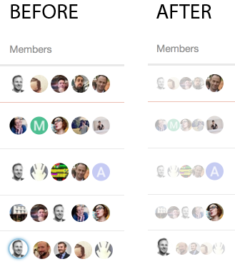

# discourse-compact-member-list

Theme for [Discourse](https://meta.discourse.org) forums, altering the display of members on topic lists

* Better use of screen real-estate: Shrinks icons of all but the latest poster
* Less "busy" - emphasises only the latest poster
* Clearer when first poster is the latest poster

### Example

### Installation

1. Admin > Customize > Themes > Import > From the web
2. Type: https://github.com/chrisbeach/discourse-compact-member-list
4. Select your current theme (it's indicated with a star)
5. Under "Theme Components," select "Compact Member List" and click "Add"

### In use at:

* [SE23.life](https://se23.life)
* [SE26.life](https://se26.life)

### See also

[How to create a theme in Discourse](https://meta.discourse.org/t/how-to-develop-custom-themes/60848?source_topic_id=47494)

### License

Apache 2.0